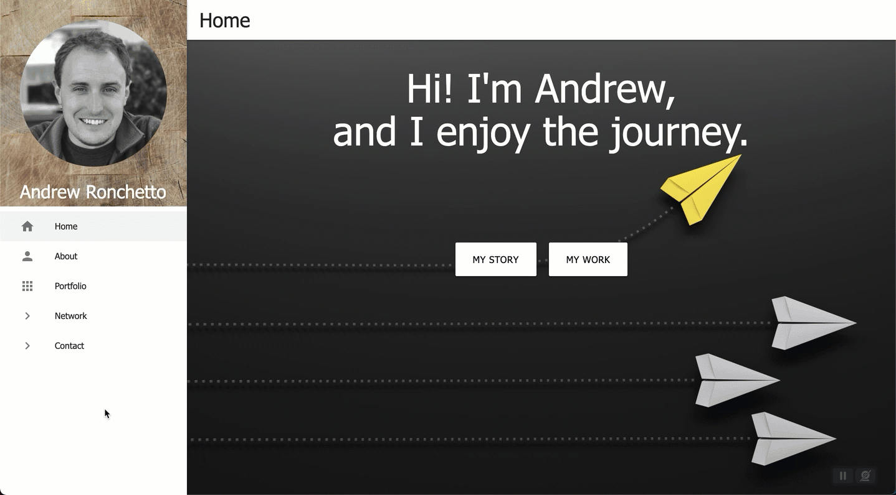
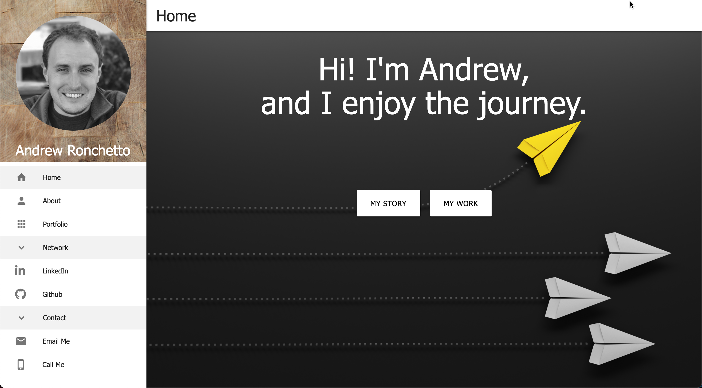
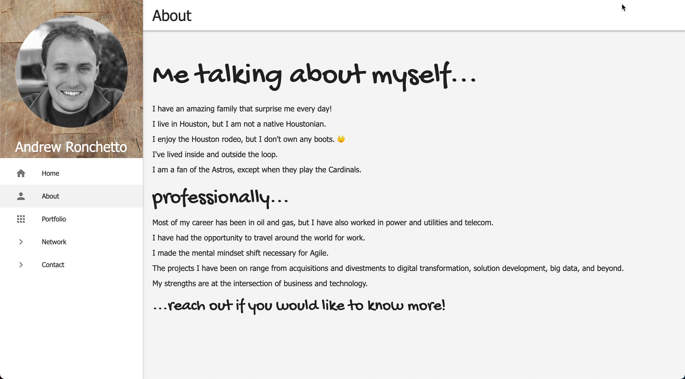
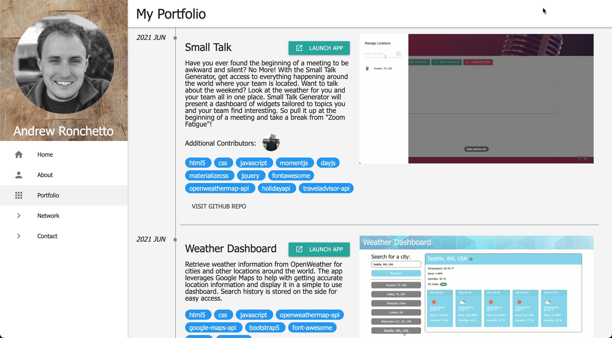

# advanced-portfolio
## Description
A personal updated portfolio demonstrating a variety of the skillsets acquired since the beginning of the class. Calling from Github to retrieve the list of public pinned repos, details, and topics to dynamically create a timeline.

## Usage
You can access the app here [https://andrew.ronchetto.me](https://andrew.ronchetto.me).

## User Story
**AS A(N)** interested party 
I **WANT** learn more about you 
**SO THAT** I can connect with you

### Acceptance Criteria
* Updated portfolio featuring Project 1 and two exemplary homework assignments.
  1. Display your contact information. If you don't want to share your personal email or phone number, use a separate email that you will only use for coding, also known as a developer email, and/or a call forwarding service, such as [Google Voice](https://voice.google.com/).

  2. Have links to your GitHub profile and LinkedIn profile

  3. Have a link to a downloadable PDF of your resume

  4. Display at least 2 examples of student work from either deployed projects or homeworks. For each project, make sure you have the following:

	  * Project title

	  * Link to the deployed version

	  * Link to the GitHub repository

	  * Screenshot of the deployed application

  5. Have a polished, mobile-responsive user interface.

* Updated GitHub profile with pinned repositories featuring Project 1 and two exemplary assignments.

  1. Profile picture or avatar

  2. Biography

  3. Email address. If you don't want to share your personal email or phone number, use a developer email.

  4. Link to your deployed portfolio

  5. At least 2 pinned repositories.

  6. Follow a few of your classmates and/or other developers. They are the beginning of your professional network and being a developer is as much about being a part of the community as it is writing code.

  7. README files. Every pinned project should contain a README file with:

	  * Title of app

	  * Live link to deployed app

	  * List of technologies used

	  * 1-2 sentences explaining what the app is

	  * 2-3 Screenshots / gifs of the app

	  * License (usually MIT)
	
	  * Contact information for you and any collaborators

  8. Commit history. Every pinned repository should have at least 20 commits.

* Updated resume

* Updated LinkedIn profile
    1. A strong bio statement
    
    2. A professional photo
    
    3. Links to your Github and portfolio

## Licenses

## Technologies

## Mock-up
The following picture shows the website appearance and capabilities:

 

 

## Installation
To fork this code to further improve the website, please follow these directions:

1. In Github fork the repository.
1. Clone the repository to your local computer.

_This assumes that you have setup your own SSH keys to connect with Github._

## References
[MDN Web Docs](https://developer.mozilla.org/en-US/docs/Web/HTML/Element) 
[W3 Schools](https://www.w3schools.com/) 
[jQuery](https://jquery.com) 
[jQueryUI](https://jqueryui.com) 
[freeCodeCamp](https://www.freecodecamp.org/news/three-ways-to-title-case-a-sentence-in-javascript-676a9175eb27/);

## Inspiration
[jtom.me](https://jtom.me/portfolio/)